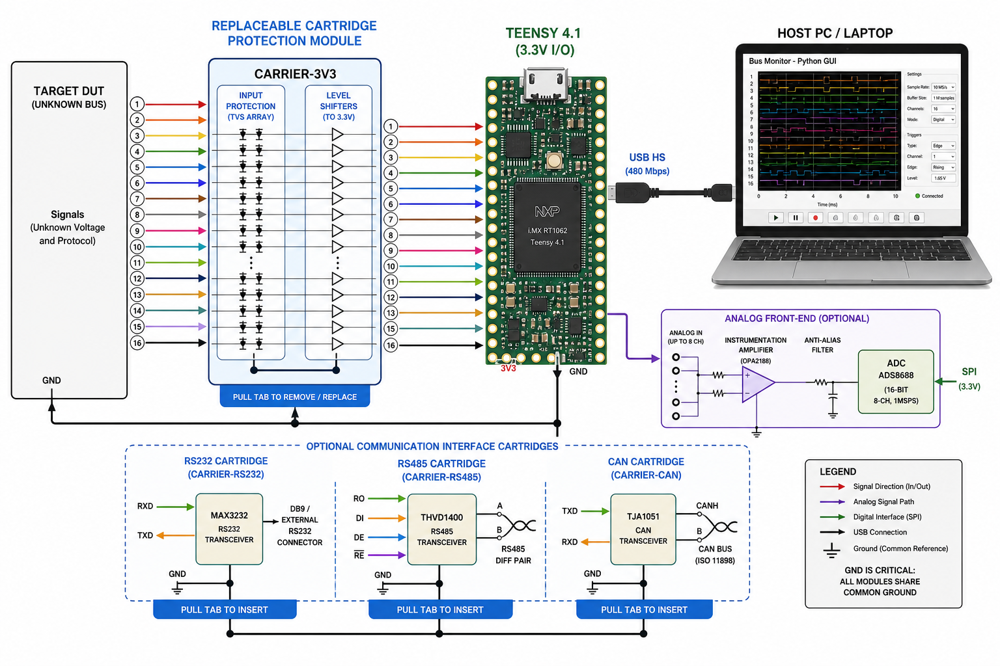
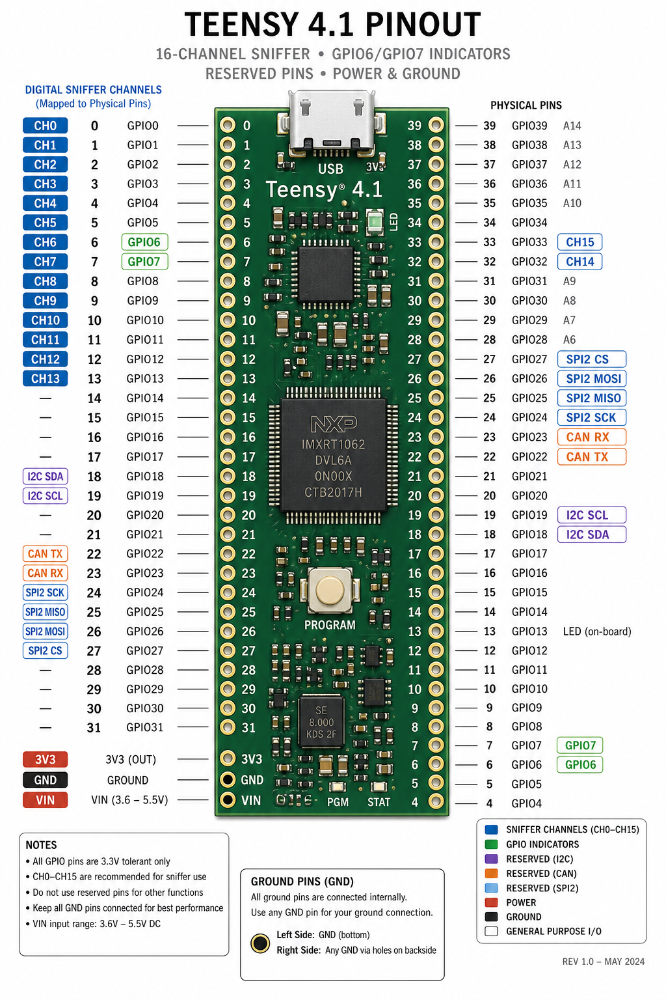
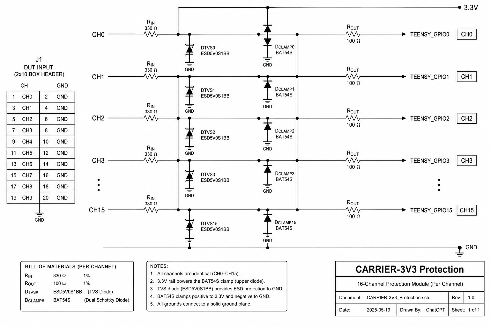
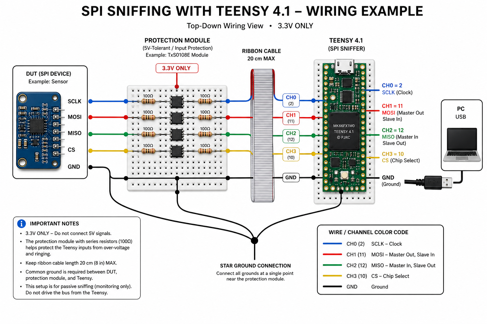

# Pin Connection Diagrams — Teensy 4.1 Universal Sniffer (Complete Reference)

**Project:** `Sniffer_Teensy_V1` — 16-channel logic analyzer (Phase 1: raw transition capture)  
**Board:** Teensy 4.1 (PJRC, i.MX RT1062, 600 MHz, 55 I/O)  
**This document is the single wiring authority.** Always verify with a multimeter before powering. `docs/07-safety-and-wiring.md` is mandatory pre-read.

> **Golden rule:** `Teensy GPIO = 0–3.3 V ONLY`. Never wire >3.3 V without the correct cartridge. Every diagram below shows the protection module *first*.

---

## 1. System Overview — Where the Pins Go



```
┌──────────────┐   16× 0–3.3V (or via transceiver)   ┌─────────────────┐  USB HS 480Mb  ┌──────────────────┐
│  TARGET DUT  │ ──────────────────────────────────▶ │  PROTECTION /   │ ─────────────▶ │  HOST PC (Python)│
│ (unknown)    │   SCLK/MOSI/MISO/CS, SDA/SCL,       │  CARTRIDGE      │  CDC-ACM       │  .stcap, waveform │
│              │   UART TX/RX, 1-Wire, etc. + GND    │  (replaceable)  │  framed binary │                  │
└──────────────┘                                     │  16× 330R+TVS    │                └──────────────────┘
         ▲                                           └───────┬─────────┘
         │  GND MUST be common                         16× 0–3.3V CMOS │
         └────────────────────────────────────────────▶│ Teensy 4.1    │
                                                       │  GPIO6/7 PSR  │
                                                       │  DWT 64-bit   │
                                                       └───────────────┘
                                                               │
лон                                                Analog branch (Ph.12) ──  divider+OPA + ADS8688 → SPI2 (24-27)
                                                 Differential branches ──  MAX3232 / THVD1400 / TJA1051 → separate carts
```

*The Teensy is **device**, never host. It samples 16 GPIOs via `GPIO6_PSR`/`GPIO7_PSR` in 1 cycle, timestamps via `DWT_CYCCNT`, double-buffers, streams framed binary.*

---

## 2. Teensy 4.1 Board — Physical Pinout (Top View, USB Top)



```
                             USB (Micro-B)  HS PHY
                           ┌───────────────┐
                           │  ● Teensy 4.1 │        * Pin numbers are Arduino names
              VIN (5V in) ─┤•              •├─ 3.3V (out, 250mA max)
                  GND ─────┤•              •├─ GND
   CH0  GPIO6:3   AD_B0_03=0├•              •├─ 33  B0_13  GPIO7:13 = CH15
   CH1  GPIO6:2   AD_B0_02=1├•              •├─ 32  B0_12  GPIO7:12 = CH14
   CH2  GPIO6:4   EMC_04  =2├•              •├─ 31  (CARTRIDGE_ID1)
   CH3  GPIO6:5   EMC_05  =3├•              •├─ 30  (CARTRIDGE_ID0)
   CH4  GPIO6:6   EMC_06  =4├•              •├─ 29
   CH5  GPIO6:8   EMC_08  =5├•              •├─ 28
   CH6  GPIO6:10  B0_10   =6├•              •├─ 27  (SPI2 SCK — reserved)
   CH7  GPIO6:17  B1_01   =7├•              •├─ 26  (SPI2 CS — reserved)
   CH8  GPIO6:16  B1_00   =8├•              •├─ 25  (SPI2 MISO — reserved)
   CH9  GPIO6:11  B0_11   =9├•              •├─ 24  (SPI2 MOSI — reserved)
  CH10  GPIO6:0   B0_00   =10├•              •├─ 23  (FlexCAN2 TX — reserved CAN)
  CH11  GPIO6:1   B0_01   =11├•              •├─ 22  (FlexCAN2 RX — reserved CAN)
  CH12  GPIO6:9   EMC_09  =12├•              •├─ 21
  CH13  GPIO6:7   EMC_07  =13├• LED          •├─ 20
               (SD) B0_02 =14├•              •├─ 19  SCL0 (reserved I2C)
               (SD) B0_03 =15├•              •├─ 18  SDA0 (reserved I2C)
                     EMC_10=16├•              •├─ 17
                     EMC_11=17├•              •├─ 16
                     ─────────────────────────────────
                           │  SD card slot (bottom)
                           └───────────────┘
        GND pins also: near VIN, near 3.3V, and bottom row — use at least 3 GND wires
```

> **Use only the 16 CH pins for logic.** Everything else is reserved or power/GND. See §7 for reserved pins.

---

## 3. Logical → Physical Mapping (Firmware Default, Phase 1)

**What the GUI shows (`CH0…CH15`) vs. Teensy Arduino pin.** You can re-map in `Channel Configuration` without recompiling.

| Logic | Label default | Teensy pin | GPIO / bit | Alt name | Notes |
|---|---|---|---|---|---|
| **CH0** | CH0 | **0** | GPIO6 bit 3 | AD_B0_03 / RX1 | Best for SCLK in jig |
| **CH1** | CH1 | **1** | GPIO6 bit 2 | AD_B0_02 / TX1 |  |
| **CH2** | CH2 | **2** | GPIO6 bit 4 | EMC_04 |  |
| **CH3** | CH3 | **3** | GPIO6 bit 5 | EMC_05 |  |
| **CH4** | CH4 | **4** | GPIO6 bit 6 | EMC_06 |  |
| **CH5** | CH5 | **5** | GPIO6 bit 8 | EMC_08 |  |
| **CH6** | CH6 | **6** | GPIO6 bit 10 | B0_10 |  |
| **CH7** | CH7 | **7** | GPIO6 bit 17 | B1_01 |  |
| **CH8** | CH8 | **8** | GPIO6 bit 16 | B1_00 |  |
| **CH9** | CH9 | **9** | GPIO6 bit 11 | B0_11 |  |
| **CH10** | CH10 | **10** | GPIO6 bit 0 | B0_00 | Also SD CS — SD disabled in Phase 1 |
| **CH11** | CH11 | **11** | GPIO6 bit 1 | B0_01 | Also SD MOSI |
| **CH12** | CH12 | **12** | GPIO6 bit 9 | EMC_09 |  |
| **CH13** | CH13 | **13** | GPIO6 bit 7 | EMC_07 | Mirrors on-board LED (intentional) |
| **CH14** | CH14 | **32** | GPIO7 bit 12 | B0_12 | Lower header, behind SD |
| **CH15** | CH15 | **33** | GPIO7 bit 13 | B0_13 |  |

*Why these pins?* 14 of 16 on **one port** (`GPIO6`), only 2 on `GPIO7` → single `GPIO6_PSR` read + 2-bit fixup = 8–12 cycles/sample, <15 ns skew. `GPIO9` (pins 14–23) would force a third port + FlexIO DMA complexity — avoided for bring-up.

**Firmware packer** (`include/channels.h`):

```cpp
inline uint16_t readChannelsPacked() {
  uint32_t psr6 = GPIO6_PSR; // 1 cycle
  uint32_t psr7 = GPIO7_PSR;
  uint16_t s = 0;
  s |= ((psr6 >> 3)  & 1) << 0; // pin0
  s |= ((psr6 >> 2)  & 1) << 1; // pin1
  s |= ((psr6 >> 4)  & 1) << 2; // pin2
  // ... (14 more, precomputed)
  s |= ((psr7 >>12) & 1) <<14; // pin32
  s |= ((psr7 >>13) & 1) <<15; // pin33
  return s & enableMask;
}
```

---

## 4. Recommended Connector — 2×10 Box Header (16+8)

Do **not** fly-wire 16 loose Duponts for >1 MHz — crosstalk + ground bounce. Use a ribbon with per-pair GND.

**Harness: `H1` (main 16-ch)**

```
  IDC Box 2×10  (0.1", keyed, shrouded)
  Pin: Signal  |  Pin: Signal
    1 : CH0   ─┼─  2 : GND
    3 : CH1   ─┼─  4 : GND
    5 : CH2   ─┼─  6 : GND
    7 : CH3   ─┼─  8 : GND
    9 : CH4   ─┼─ 10 : GND
   11 : CH5   ─┼─ 12 : GND
   13 : CH6   ─┼─ 14 : GND
   15 : CH7   ─┼─ 16 : GND
   17 : CH8   ─┼─ 18 : CH9   (optionally 18:GND if 16+8 ribbon)
   19 : CH10  ─┼─ 20 : CH11
  ── expansion row if 2×16 used ──
   21 : CH12  ─┼─ 22 : GND (on 2×16)
   23 : CH13  ─┼─ 24 : GND
   25 : CH14  ─┼─ 26 : GND
   27 : CH15  ─┼─ 28 : GND
   29 : CART_ID0 ─┼─ 30 : CART_ID1
   31 : 3.3V (ref) ─┼─ 32 : GND

  Ribbon: <20 cm for >2 MHz, twist or interleave GND, 100 mil pitch.
  Crimp with proper IDC tool — tinned ends oxidize.
```

**Carrier board edge:**

```
  Teensy side (2×20 female header)  →  IDC ribbon → DUT probe tips / grabbers
  All GND pins star to solid ground plane — check <0.1 Ω to Teensy GND.
```

---

## 5. Protection Module — CARRIER-3V3 (Default, Phase 1)



**One channel (×16 identical). Values are E12, 0603/0805.**

```
  DUT Probe ──●── 330Ω (1%, 0.25W) ──┬── 100Ω ──●──► Teensy GPIO (3.3V CMOS)
              │                      │           │
           (pad)                   TVS ── GND   │
              │                      │           │
              └──────────────────── BAT54S ─────┘
                                   /  \
                                3V3    GND  (dual Schottky common-cathode)
```

* **330 Ω** — current limit: `I = (Vdut-3.3)/330`. At accidental 5 V → ~5 mA (survives transient, not continuous 12 V). For automotive, use divider/next cartridge.
* **TVS:** `PRTR5V0U4Y` 4-ch array or `ESD5V0S1BB` per channel, `Vrwm 5 V`, `Clamp ~9 V @ 8 A`. Place <2 mm from input pad.
* **BAT54S:** optional secondary clamp (Schottky `Vf ~0.3 V`) to `3.3V`/`GND` rails. Solder only after TVS.
* **100 Ω:** dampens edge ringing, isolates TVS capacitance (~30 pF) from GPIO.
* **100 pF to GND** (optional, across TVS) — low-pass ~4 MHz, remove for >5 MHz capture.
* **Ground:** solid plane, via-stitched, pour under TVS. Keep `3.3V` fat trace.

**Assembly note:** Replaceable cartridge — use `2×20` male header to Teensy, `2×10` box header to DUT. Do not solder unknown-voltage wire directly to Teensy.

---

## 6. Power & Ground — The Most Common Failure

```
  USB (PC) 5V ──► Teensy VIN ──► 3.3V LDO (600mA) ──► 3.3V pin ──► Cartridge 3.3V rail (clamp + pull)
         │                │                     │
         └──── GND ───────┴────── GND plane ────┴──► Cartridge GND ──► DUT GND (STAR)
                      ▲
                      │  NEVER float GND — floating = apparent 10 V spikes = dead Teensy
  Teensy GND pins: near VIN, near pin 0, bottom row (use ≥3 wires)
  DUT GND: connect FIRST, disconnect LAST, <10 cm lead, 22 AWG or braid
  Do not power DUT from Teensy 3.3V if DUT draws >50 mA — use external supply, common GND
```

**Current budget:** Teensy `~120 mA` + cartridge `<20 mA` → USB 2.0 safe. If adding external ADC/transceivers, add separate `5 V` buck.

---

## 7. Reserved Pins — Do Not Use for Logic (Phase 1)

| Teensy pin | Arduino | GPIO | Use | Why reserved |
|---|---|---|---|---|
| 18 | SDA0 | AD_B1_07 | **I²C0 SDA** | Reserved for ADS8688 / EEPROM calibration (Phase 12) |
| 19 | SCL0 | AD_B1_06 | **I²C0 SCL** | — |
| 22 | — | AD_B1_02 | **CAN2 TX / UART4 TX** | For TJA1051/TJA1443 CAN FD transceiver |
| 23 | — | AD_B1_03 | **CAN2 RX / UART4 RX** | — |
| 24 | MOSI2 | AD_B0_12 | **SPI2 MOSI** | For ADS8688 external ADC |
| 25 | MISO2 | AD_B0_13 | **SPI2 MISO** | — |
| 26 | SCK2 | AD_B0_14 | **SPI2 SCK** | — |
| 27 | CS2 | AD_B0_15 | **SPI2 CS** | — |
| 30 | — | EMC_32 | **CARTRIDGE_ID0** | Strap to GND/3.3 via cartridge resistor |
| 31 | — | EMC_33 | **CARTRIDGE_ID1** | — |
| 14–17 | — | — | SDIO / FlexPWM | Avoid bus contention with SD |
| 34–39 | — | — | SDIO / QSPI Flash | — |
| VIN, 3.3V, GND | — | — | Power | — |
| USB D+/D- | — | — | USB HS | Dedicated |

If you *must* reclaim a reserved pin, edit `firmware/include/config.h` `CHANNEL_PHYS_PINS` and `docs/02` and rebuild; host `Channel Configuration` also allows logical→physical remap without recompile.

---

## 8. Cartridge ID Straps — Auto-Detect Front-End

Teensy reads `30`/`31` at boot (internal `INPUT_PULLUP`). Cartridge pulls to GND via `10 k`.

```
  Teensy 30 ──●── 10k ── GND ? → reads 0
              └── NC (pullup) → reads 1
  Teensy 31 ──●── same

  00 = CARRIER-3V3 (direct + TVS)
  01 = CARRIER-5V (TXS0108)
  10 = CARRIER-RS232/485
  11 = CARRIER-ANALOG

  No cartridge (floating) → reads 11 → firmware coerces to 00 (safe default, but GUI warns)
```

Firmware includes `cartridge_id` in `HELLO_ACK`; GUI shows it and warns on mismatch.

```
  Cartridge PCB:  place 0Ω or 10k as needed, near Teensy header
  Teensy PCB:   30/31 → 10k pullup (internal) + 100 nF cap to GND for debounce
```

---

## 9. Example Wirings — Copy These

> All examples assume **CARRIER-3V3** and `CARRIER-3V3` strap `00`. If DUT is 5 V / RS-232 / differential, swap cartridge first — see §10.

### 9.1 SPI (4-wire) — The Classic Case



**GUI preset:** `SPI 4-wire` → `CH0=SCLK, CH1=MOSI, CH2=MISO, CH3=CS`.

```
  DUT (sensor, flash, MCU)          Protection (CARRIER-3V3)          Teensy
  ─────────────────────            ────────────────────────           ───────
  SCLK (out) ─────●──────────────── 330R+TVS+100R ──────────────────● CH0 (pin 0)
  MOSI (out) ─────●──────────────── 330R+TVS+100R ──────────────────● CH1 (pin 1)
  MISO (in)  ─────●──────────────── 330R+TVS+100R ──────────────────● CH2 (pin 2)
  CS/SS  (out, active low) ───────── 330R+TVS+100R ──────────────────● CH3 (pin 3)
  GND ────────────●───────────────── solid plane ───────────────────● GND (all GND pins)
  (NC: CH4-15 leave floating or disable in GUI)

  Ribbon colors (suggested):
    SCLK blue, MOSI red, MISO green, CS yellow, GND black/brown
  Keep <20 cm, per-pair GND, no stubs on SCLK.
```

**If SPI is 5 V (e.g., Arduino Uno):** swap to `CARRIER-5V` (§10.1), same logical pins, GUI same.

---

### 9.2 I²C (2-wire, open-drain)

```
  DUT               Protection (3V3)          Teensy
  SDA ──●──── pullup 2.2k–4.7k to 3.3V ─ 330R+TVS ─● CH0 (pin 0)  ← SDA
  SCL ──●──── pullup 2.2k–4.7k to 3.3V ─ 330R+TVS ─● CH1 (pin 1)  ← SCL
  GND ──●──── (common) ─────────────────────────● GND

  Note: I²C is open-drain — DUT may already have pullups to 5 V or 3.3V.
        Measure SDA/SCL high level before connecting.
        If 5 V pullup, use CARRIER-5V instead of 3V3.
        GUI preset: I2C (2-wire).
```

---

### 9.3 UART (async, idle high, 8N1 etc.)

```
  DUT                         Protection          Teensy
  TX (out) ──●──────────── 330R+TVS ──────────● CH0 (pin 0)  ← RX
  RX (in)  ──●──────────── 330R+TVS ──────────● CH1 (pin 1)  ← TX (optional to sniff both directions)
  GND ──────●──────────── solid plane ───────● GND

  Baud: any ≤2 Mbaud (Phase 1). Inversion/parity set in GUI (Phase 7).
  If DUT is RS-232 (±12 V), DO NOT use this — use MAX3232 cartridge (§10.2).
```

---

### 9.4 1-Wire (open-drain, strong pullup)

```
  DUT                         Protection          Teensy
  DQ ──●──── pullup 4.7k to 3.3V ─ 330R+TVS ──● CH0 (pin 0)
  GND ──●──── common ───────────────────────● GND

  1-Wire needs precise timing — keep leads short, disable TVS cap (remove 100pF) for faster edges.
```

---

### 9.5 8-bit Parallel Bus (e.g., 8080 LCD, SRAM)

```
  DUT D0..D7  ──●─ each 330R+TVS ─● CH0..CH7 (pins 0,1,2,3,4,5,6,7)
  DUT WR/RD   ──●─ 330R+TVS ─● CH8 (pin 8)
  DUT CS      ──●─ 330R+TVS ─● CH9 (pin 9)
  GND ────────●─ plane ─● GND
  GUI preset: 8-bit Parallel → CH0-7 = D0-7
```

---

## 10. When Bare 3.3 V Is Not Enough — Use a Different Cartridge

### 10.1 5 V TTL/CMOS (Arduino Uno, AVR, 5 V SPI) — CARRIER-5V (TXS0108)

**Never use divider for >1 MHz — edge skew + loading.**

```
  DUT 5V side          TXS0108E (8-ch, auto-dir)         Teensy 3.3V side
  ───────────          ─────────────────────────          ────────────────
  SCLK 5V ──●──── B1 ──│ A1 ──●─── 100Ω ──● CH0 (pin 0)
  MOSI 5V ──●──── B2 ──│ A2 ──●─── 100Ω ──● CH1 (pin 1)
  MISO 5V ◀─●──── B3 ──│ A3 ──●─── 100Ω ──● CH2 (pin 2)  // MISO dir is B←A? TXS is auto-dir — either works
  CS   5V ──●──── B4 ──│ A4 ──●─── 100Ω ──● CH3 (pin 3)
  GND ──────●──── GND ─│ GND ──●──● GND
  5V  ──────●──── VCCB (B)    VCCA=3.3V ─●── Teensy 3.3V
             OE ──●─── 10k ── VCCB (enable high), jumper to GND to tristate

  Need 16 ch → use TWO TXS0108 (U1: CH0-7, U2: CH8-15), tie OE together.

  Straps: pull ID pin 31 to GND via 10k → reads 01 → GUI shows CARRIER-5V.
```

---

### 10.2 RS-232 (±3…±15 V, DB9) — CARRIER-RS232 (MAX3232)

**One MAX3232 = 2 channels, so 8 chips for 16 ch is impractical — use 4-ch module for needed lanes.**

```
  DB9 / DUT                MAX3232 (3.3V)                 Teensy
  ────────                 ─────────────                  ───────
  RS232 TX (-12…+12) ─●─ RIN1 ─┤─ ROUT1 ─●─● CH0 (pin0)   // TOUT/TIN not used for sniffing
  RS232 RX (-12…+12) ─●─ RIN2 ─┤─ ROUT2 ─●─● CH1 (pin1)
  GND ──────────────●─ GND ─┤─ GND ─●─● GND
  3.3V ─────────────●─ VCC ─┘  C1+/C1- : 0.1µF charge pump caps (4×)

  Practical: sniff only TX/RX (+ RTS/CTS if needed). Use external USB-RS232 tap if you need all 8 handshake lines.
```

---

### 10.3 RS-485 / Half-Duplex Differential (A/B) — CARRIER-RS485 (THVD1400)

```
  DUT A ─●─┐
            ├──┤ A ├── THVD1400 ── RO (single-ended, 3.3V) ─● CH0 (pin0)
  DUT B ─●─┘    │ B │
  GND ──●───────┤ GND
  (If full-duplex, use THVD1450 with separate RO for each pair)

  Termination: 120Ω across A/B at far end if cable >1 m or >1 Mbaud.
  Never sniff A or B single-ended — use the RO output.
```

---

### 10.4 CAN (CANH/CANL, 2.5 V common, dominant/recessive) — CARRIER-CAN (TJA1051/TJA1443 + Controller)

**Teensy alone cannot decode CAN — needs transceiver + controller.** FlexCAN pins 22/23 are wired to transceiver.

```
  CANH ─●─┬── CT ── TJA1051 ── RXD (3.3V) ─● CH? not direct — FlexCAN RX (pin 23)
  CANL ─●─┘   │      │  VCC 3.3V
  GND ──●─────┴──────┴── GND
                 │
  Teensy CAN TX (pin22) ── TXD ─┘ (for ACK, not needed to sniff)

  Better: use external MCP2515 (SPI2 on 24-27) for full CAN — decoded packets then stream via framed binary (Phase 11).
```

---

### 10.5 Automotive 12 V / 24 V (Dirty) — Divider + Opto

```
  12V signal (e.g., LIN, injector) ── 10k ─┬── 3.3k ── GND  (divider → ~3.0V at 12V)
                                            │
                                         3.3V Zener (BZX84) to GND ── 1k ──● CHx
                                            │
  For isolation (preferred): 12V → 1k → opto LED (ACPL-247) → opto transistor → 3.3V → CHx
  Always star GND to chassis, keep Teensy away from inductive spikes (relay, coil).
```

---

### 10.6 Analog 0–5 V Sensor — Divider + Follower + External ADC (Phase 12)

```
  Sensor 0–5V ── 10k ─┬── 20k ── GND  (divide 5→3.33, use 10k/15k for 5→3.0 with margin)
                      │
                    OPA2376 follower (low Z) ──●── ADS8688 CH0 (16-bit, SPI2)
                      │
                    Teensy ADC (pins 14-23) only for low-speed <1 kS/s — not precision

  Calibration in GUI: Vactual = raw*gain + offset, stored per channel in ~/.sniffer/cal.json
```

---

## 11. Grounding & Shielding — Checklist

- [ ] `DUT GND` ↔ `Teensy GND` ↔ `Cartridge GND` <0.1 Ω (measure with DMM). Use 22 AWG, <10 cm.
- [ ] ≥3 GND wires in ribbon (even pins) — reduces loop inductance.
- [ ] Ribbon <20 cm for >2 MHz, twist or interleave GND, no pigtails >2 cm.
- [ ] No ground loops via USB + external supply — use same star point.
- [ ] Keep Teensy away from 5 V/12 V rails, motors, inductors.
- [ ] Probe tips: 100 mil headers + grabbers (Pomona 5250), not bare Dupont.

---

## 12. Loopback & Continuity Test Plug (Validate Harness)

Build a 2×10 loopback plug: short `CH0↔CH1`, `CH2↔CH3`, `CH4↔CH5`, `CH6↔CH7`, etc., with `GND` open.

```
  Loopback plug (IDC female):
    1(CH0)──●──● 3(CH1)
    5(CH2)──●──● 7(CH3)
    9(CH4)──●──●11(CH5)
   13(CH6)──●──●15(CH7)
   17(CH8)──●──●19(CH10)  … etc.

  Firmware test: send CMD_DIAGNOSTICS_PIN_TOGGLE (GPIO6_DR_TOGGLE) → host should see alternating edges on paired CH.
  Or GUI: Device → Diagnostics → “Toggle CH0” → Waveform should show CH1 following.
```

---

## 13. Quick-Reference — Which Cartridge for Which Bus

| Bus / Voltage | Direct? | Cartridge | Teensy pins | GUI preset |
|---|---|---|---|---|
| 3.3 V CMOS UART/SPI/I2C/1-Wire | ✅ | **CARRIER-3V3** (330R+TVS) | CH0-15 (any) | SPI/I2C/UART/etc. |
| 5 V TTL/CMOS | ❌ | **CARRIER-5V** (TXS0108 ×2) | same | — |
| 1.8 V | ❌ | **CARRIER-5V** with LSF0108 1.8V | same | — |
| RS-232 ±12 V | ❌ | **CARRIER-RS232** (MAX3232) | CH0-3 typical | UART + invert |
| RS-485 diff | ❌ | **CARRIER-RS485** (THVD1400) | RO → CH0 | custom |
| CAN diff 2.5V | ❌ | **CARRIER-CAN** (TJA1051 + MCP2515) | FlexCAN 22/23 | CAN plugin |
| 12/24 V automotive | ❌ | Divider + clamp + opto | CH0 | — |
| Analog 0–5 V | ❌ | Divider + OPA + ADS8688 (SPI2) | ADC 24-27 | Sensor Analyzer |

*If you are unsure, use CARRIER-3V3 + measure DUT high level first. If >3.6 V, swap cartridge.*

---

## 14. Firmware ↔ Host Re-map Without Recompile

Edit `Channel Configuration` → `Label` / `Enable` / `Color` / `physPin`. On **Apply**, host sends `CONFIG_CHANNELS` (`enableMask, risingMask, fallingMask`); firmware calls `channels::applyMasks()`. Keep `CHANNEL_PHYS_PINS[16]` in `firmware/include/config.h` as default; override per-session.

Example: move `SCLK` from `CH0@0` to `CH4@4`:

```
  GUI: Channels → CH0 disable, CH4 label SCLK → Apply
  No rebuild, next capture uses CH4 as SCLK.
```

---

## 15. Powering Teensy & DUT Together

- **Teensy alone:** USB provides 5 V → on-board 3.3 V LDO. Leave `VIN` disconnected.
- **Teensy + external 5 V:** Cut `VUSB` trace (or remove jumper) and feed `VIN` from external 5 V, common GND.
- **Never** feed 5 V into `3.3V` pin — it is output.
- **USB isolation:** For mains/high-voltage DUT, use `ADuM3160`/`ADuM4160` USB isolator or isolated `5 V` DC-DC + `ISO7741` on signals.

---

## 16. Printable Wiring Checklist (Copy Before Each Capture)

1. [ ] DUT powered OFF, Sniffer USB disconnected.
2. [ ] DMM: measure DUT signal high vs. DUT GND — within cartridge range?
3. [ ] Select cartridge (`3V3`/`5V`/`RS232`/`485`) — check straps read correctly in GUI `HELLO_ACK`.
4. [ ] Connect `GND` first (3 wires, star, <10 cm).
5. [ ] Connect signals via protection module — shortest leads, per-pair GND.
6. [ ] Power DUT, then plug USB, open GUI → Device → Connect → `FW x.y.z, CART-xxx` appears.
7. [ ] Channel Config → enable needed CH, preset, Apply.
8. [ ] Capture 10 ms test → Waveform shows stable levels? No flicker?
9. [ ] Full capture → Save `.stcap` → Export CSV if needed.

---

## 17. Files & Next Steps

* `firmware/include/config.h` — change `CHANNEL_PHYS_PINS` to make a new jig permanent.
* `docs/07-safety-and-wiring.md` — deeper safety.
* `docs/11-build-and-troubleshooting.md` — if no connect / CRC errors / overflow.
* `captures/example_spi.stcap` etc. — demo captures to test GUI without hardware.

> **Need a custom jig (e.g., 16× Pogo for an ECU)?** Keep the protection module, make a small daughter board with the same 2×10 header — Teensy side unchanged.

---

*End of pin reference — keep a printed copy near the bench.*
