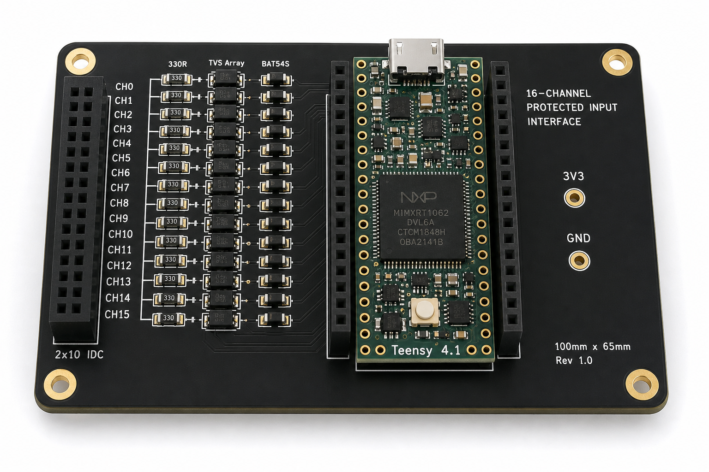
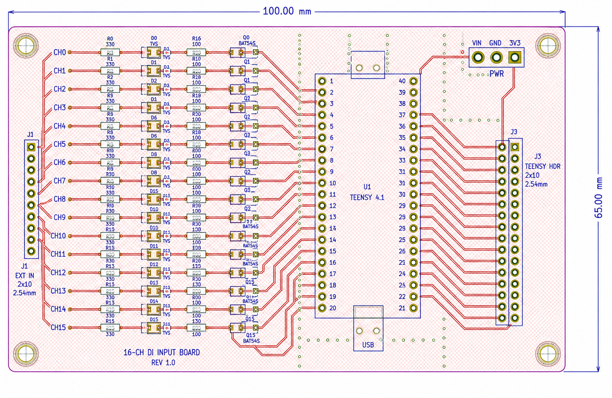
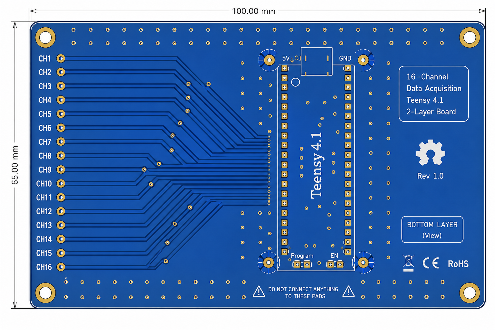
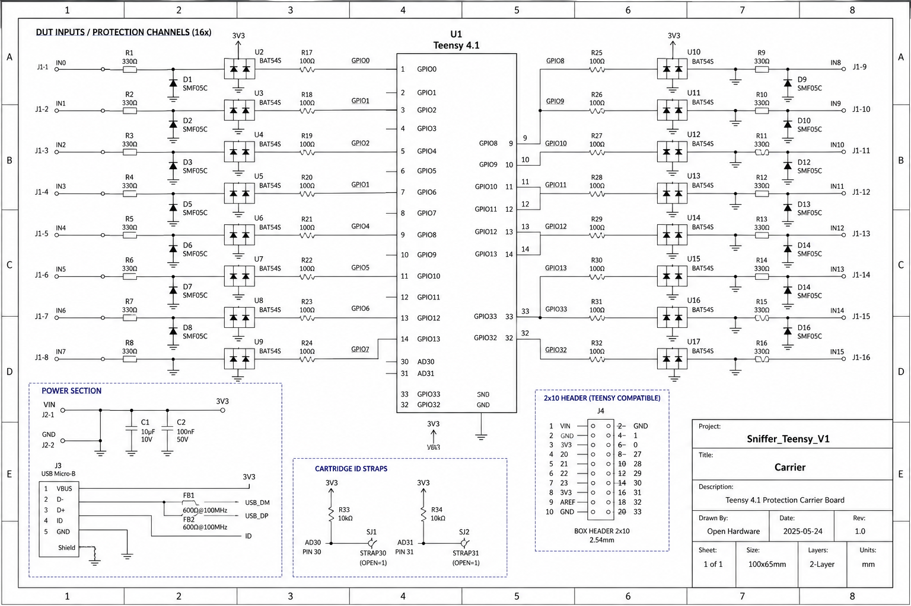

# Sniffer Teensy V1 — 2-Layer Carrier PCB (100 × 65 mm)

**Teensy 4.1 socketed carrier + 16-channel protected front-end (CARRIER-3V3). 2-layer, 1.6 mm FR-4, 1 oz copper, ENIG, HASL optional.**

This is the **base carrier** that the replaceable cartridges plug into. The default build is `CARRIER-3V3` (330 Ω + TVS + BAT54S). The same PCB accepts `CARRIER-5V` (TXS0108) or `CARRIER-RS232/485` by swapping the front-end module — Teensy side unchanged.

---

## 1. Images

| View | File |
|---|---|
| 3D top (black, Teensy socketed) | `hardware/images/pcb-3d-top.png` |
| Top copper (red) | `hardware/images/pcb-layout-top.png` |
| Bottom copper (blue, GND plane) | `hardware/images/pcb-layout-bottom.png` |
| Schematic | `hardware/images/schematic-carrier.png` |






---

## 2. Stackup & Fab

| Parameter | Value |
|---|---|
| Layers | 2 (Top + Bottom) |
| Material | FR-4, Tg 130–140 |
| Thickness | 1.6 mm ±10% |
| Copper | 1 oz (35 µm) both sides |
| Finish | ENIG (preferred) or HASL |
| Soldermask | Black (or dark blue) — white silkscreen |
| Silkscreen | Both sides, `CH0…CH15`, `VIN/GND/3V3`, `CART ID` |
| Min trace | 0.20 mm (8 mil) — we use 0.25 mm for signals, 0.50 mm for power |
| Min clearance | 0.20 mm (8 mil) |
| Min via | 0.40 mm drill / 0.80 mm pad (thru) |
| Via stitching | 1.0 mm pitch along GND edges |
| Impedance | Not controlled (2-layer, <5 MHz logic) — keep <20 cm ribbon |
| Panel | 2×2 with V-groove, 5 mm rails, fiducials |

**Fab notes for JLCPCB / PCBWay:**

```
Layer count: 2
Dimensions: 100.0 × 65.0 mm (3.937 × 2.559")
Thickness: 1.6mm
Copper weight: 1oz
Surface: ENIG (or HASL if cost)
Soldermask: Black
Silkscreen: White both sides
Edge connector: No
Impedance: No
Castellated: No
```

Gerbers are `RS-274X` (see `hardware/gerbers/`). Zip and upload.

---

## 3. Dimensions & Mounting

```
Board: 100.0 (L) × 65.0 (W) × 1.6 (T) mm
Origin: bottom-left pad of H1 (2×10) at (5, 32.5)
Teensy: socketed via 2×14 female headers (600 mil pitch) centered at (52, 32.5)
  Orientation: USB to top edge (+Y), pin 0 to left (+X toward H1)
  Keepout: 2 mm around Teensy for insertion, height 12 mm with Teensy + pins
Mounting: 4× M3 holes, 3.2 mm drill, pads 6 mm, at (4,4), (96,4), (4,61), (96,61)
Edge keepout: 1.0 mm from outline
Box header H1: 2×10 2.54 mm box, shrouded, key notch up, at left edge (X=5)
H2 expansion (optional 2×8): at left edge below H1 for CH8-15 second row if 2×16 not used
Testpoints: TP_3V3, TP_GND (2.54 mm loop) near Teensy Vin
LED mirror: CH13 already on pin 13 — also routed to D5 (0603) near edge for visibility
```

---

## 4. Schematic Blocks (KiCad: `hardware/kicad/Sniffer_Teensy_V1.kicad_sch`)

### 4.1 Power (Sheet 1, top-left)

```
VIN (USB 5V or external) ──●── Ferrite FB1 (600Ω@100MHz) ──●── 10µF + 100nF → GND
                            │
                         Teensy VIN ── LDO → 3.3V ──●── 10µF + 4× 100nF (decoupling near Teensy + near each TVS bank)
                            │
                         3.3V rail → BAT54S common + TVS Vrwm

GND ── solid plane, star at Teensy GND (near VIN), via-stitched 1mm, keep <0.1Ω to H1 GND, to Teensy GND pins (≥3 ties)
```

### 4.2 Teensy Socket (Sheet 1, center)

```
U1: TEENSY41 (2×14 headers, 600 mil, 0.1" pitch)
  Use PJRC symbol: 48 pins, but only 16+power+GND routed.
  Pins wired per docs/02:
    CH0→0, CH1→1, CH2→2, CH3→3, CH4→4, CH5→5, CH6→6, CH7→7,
    CH8→8, CH9→9, CH10→10, CH11→11, CH12→12, CH13→13, CH14→32, CH15→33
  Reserved: 18/19 → I2C header J3 (2.54mm, for ADS8688), 22/23 → CAN header J4, 24-27 → SPI2 header J5
  30/31 → 10k pullup to 3.3V + 100nF to GND + to H1 pins 29/30 (cartridge ID)
  USB D+/D- not routed (Teensy on-board micro-B)
  AGND → GND, VIN → 5V, 3.3V → rail
```

### 4.3 Protection per Channel (Sheet 1, left — ×16 buses)

Replicated bus `CH0 … CH15`:

```
J1.H1_CHx (DUT side) ── R_330 (0603, 1%) ─┬─ R_100 (0603) ── Teensy GPIO
                                         │
                                      TVS ─ GND   (ESD5V0S1BB / PRTR5V0U4X)
                                         │
                                     BAT54S ─┬─ 3.3V (cathode)
                                             └─ GND   (anode)
                                         │
                                     (optional 100pF to GND, DNP for >5MHz)

  R_330: 330Ω, 0603, 0.25W, ±1%  (limits 5V→5mA)
  TVS: PRTR5V0U4Y (4-ch array) — one array per 4 channels, placed <2mm from H1 pads
  BAT54S: dual Schottky, SOT-23, one per 2 channels, Vf 0.32V
  R_100: 100Ω, 0603, damping
  100pF: 0603, DNP by default, pad present
```

*Place all TVS arrays along left edge, 2 mm from H1, ground vias directly to plane.*

### 4.4 Connectors

```
H1: 2×10 box header, 2.54mm, Wurth 61201021621 or CJT A2546, shrouded, K1 notch up
  Pin map per docs/02 §4:
    1:CH0  2:GND  3:CH1  4:GND ... 15:CH7 16:GND 17:CH8 18:CH9 19:CH10 20:CH11 (or 2×16 variant)
  For 2×16 variant, extend: 21:CH12 22:GND 23:CH13 24:GND 25:CH14 26:GND 27:CH15 28:GND 29:ID0 30:ID1 31:3.3V 32:GND

J2: 2×20 female socket for Teensy (Samtec SSW-120-01-T-S or cheap 14+14)
J3: 1×4 header for I2C (3V3/SDA/SCL/GND, pin 18/19) — for external ADC
J4: 1×4 header for CAN (3V3/TX:22/RX:23/GND)
J5: 2×4 header for SPI2 (3V3/MOSI24/MISO25/SCK26/CS27/GND) — for ADS8688
```

***Silkscreen:*** label every H1 pin `CH0` … `CH15`, `GND`, `ID0/ID1`, arrow for pin 1, `TEENSY 4.1` outline, `Sniffer V1 2L 100x65`, `rev 1.0`, QR to `docs/12`.

---

## 5. PCB Layout (KiCad: `hardware/kicad/Sniffer_Teensy_V1.kicad_pcb`)

### 5.1 Layer Assignment (2-layer)

| Layer | Use | Pour |
|---|---|---|
| **F.Cu (Top)** | Signals: all CH traces (0.25 mm) from H1 → R330 → TVS → R100 → Teensy, short (<25 mm), 45° bends, power 0.5 mm | No pour (keep signals clean), but GND stitch vias at TVS grounds |
| **B.Cu (Bottom)** | **Solid GND plane** — no signals except short Teensy escapes + J3/J4/J5 headers; hatched is disabled — use solid polygon, via-stitched | `GND` polygon, 0.2 mm clearance, thermal relief on pads, 1 mm via grid along edges and under Teensy |

*If a CH trace must cross, it stays on Top — jump via Bottom only for Teensy escape (≤5 mm) then back, with GND stitch via each transition.*

### 5.2 Placement (Top, (X,Y) mm from origin)

```
H1 (2×10)     at (5, 32.5), vertical, pin1 top (+Y)
R330×16       at (12, …), 0603, vertical, 2.54 mm pitch matching H1, 1.5 mm from H1
TVS arrays×4  at (15, …), SOT-143, 2 mm from R330 node, ground pad with 2 vias to B.Cu
BAT54S×8      at (18, …), SOT-23, between TVS and R100
R100×16       at (21, …), 0603, 1.5 mm from BAT node
C_100pF×16    at (15, …) (DNP) near TVS
J2 Teensy     at (52, 32.5) centered, 2×14 female, keepout 2 mm
Decoupling    at (48, 55) 10µF + 100nF near Teensy VIN/3V3
J3/J4/J5      at (80, 55) 1×4/2×4 headers along right edge
Mounting holes at 4 corners (as above)
TP_3V3/TP_GND at (45, 5) loop
```

### 5.3 Routing Rules

- **Width:** CH signals 0.25 mm (10 mil), power 0.50 mm (20 mil), GND via 0.40/0.80, stitch via 0.40/0.80.
- **Clearance:** 0.20 mm (8 mil) trace-trace, trace-pad, via-pad.
- **Length:** CH0-15 matched within ±5 mm where possible (not critical <2 MHz, but done). Max 25 mm from H1 to Teensy pin.
- **Angles:** 45°, no 90°, no stub on SCLK (CH0) — route first, keep away from GND slots.
- **Vias:** Stitch GND every 5 mm along board edge, every TVS GND pad has 2 vias, under Teensy GND pads via to plane.
- **Silkscreen:** `CHx` label above each R330, `↑ pin1` near H1, `Teensy 4.1 ↑ USB` near socket, revision, logo.
- **Cursor:** Keep analog section (if ADS8688 DNP) at bottom-right, not under Teensy.

### 5.4 2-Layer Specific Tricks (to look 4-layer)

- **No split plane:** B.Cu is *only* GND — never route power on B.Cu except short Teensy 3.3V 0.5 mm stub with stitch.
- **Virtual 4-layer:** Top carries all signals, Bottom is continuous GND → best EMC for 2L. Add 10 µF + 100 nF at each TVS bank (near left edge) to kill HF.
- **Return path:** Every signal via has adjacent GND stitch via within 2 mm.
- **Edge:** GND plane extends to 0.5 mm from edge, stitch vias at 1 mm pitch around perimeter (guard ring).

---

## 6. BOM (Per Board, 16-ch CARRIER-3V3)

| Ref | Value | Package | Qty | MPN (example) | Notes |
|---|---|---|---|---|---|
| U1 | Teensy 4.1 | Socket 2×14 | 1 | PJRC Teensy 4.1 | Socketed, not soldered |
| J1 | 2×10 box, shrouded | IDC 2.54 | 1 | Wurth 61201021621 | H1 main, key |
| J2a/J2b | 14p female 2.54 | 2×(1×14) | 2 | Samtec SSW-114 | For Teensy, 600 mil |
| R330 | 330 Ω, 1%, 0.25W | 0603 | 16 | Yageo RC0603JR-07330RL | Per CH |
| R100 | 100 Ω, 1% | 0603 | 16 | Yageo RC0603JR-07100RL | |
| C100p | 100 pF, C0G, 50V | 0603 | 16 | Samsung CL10C101JB8 | DNP default, pads present |
| U2-U5 | PRTR5V0U4Y (4-ch TVS) | SOT-457 | 4 | Nexperia PRTR5V0U4Y | 4 ch/array → 16 ch |
| D1-D8 | BAT54S dual Schottky | SOT-23 | 8 | ON BAT54S | 2 ch/chip |
| R_ID | 10 k | 0603 | 2 | | For 30/31 pullup (also Teensy internal) |
| C_ID | 100 nF | 0603 | 2 | | For ID lines |
| FB1 | Ferrite 600 Ω | 0805 | 1 | Murata BLM21PG601 | On VIN |
| C_BULK | 10 µF, 16V, X7R | 0805/1206 | 3 | Samsung CL21A106KOQ | Bulk near Teensy + near TVS banks |
| C_DEC | 100 nF, 50V | 0603 | 8 | | Decoupling |
| TPs | Loop testpoint | — | 2 | Keystone 5019 | 3.3V/GND |
| MH | M3 mounting | 3.2 drill | 4 | Holes | |
| PCB | 100×65×1.6 FR-4 | — | 1 | 2L ENIG | |

**Cost (JLCPCB, Qty 5, ENIG, black):** ~$12 board + $8 parts (without Teensy) @ single.

**Alternative cartridges (not on this PCB, plug into H1 via small daughter board):**

- `CARRIER-5V`: 2× TXS0108E (8-ch each), 0.1 µF per chip, OE 10k to VCCB.
- `CARRIER-RS232`: 4× MAX3232 + 16× 0.1 µF charge pump caps (per chip).
- `CARRIER-RS485/CAN`: THVD1400 / TJA1051.

---

## 7. Assembly Order

1. Paste bottom (no parts) → reflow GND plane (nothing to do).
2. Paste top → place: R330/R100/BAT54S/TVS/FB1/Cs/R_ID → reflow (hotplate or oven, 245 °C).
3. Hand-solder J1 (box header), J2 sockets (check height), J3-5, TPs, Teensy socket.
4. Clean, inspect TVS orientation, BAT54S cathode mark toward 3.3V.
5. Flash Teensy (USB), mount Teensy, mate cartridge/H1 loopback plug, test.

---

## 8. Bring-Up Test (5 min)

1. **Power:** USB → DMM: `3.3V` = 3.25–3.35 V, `VIN` = 4.8–5.2 V, `GND` plane <0.1 Ω.
2. **ID:** No cartridge → GUI `HELLO_ACK` shows `CART 3V3` (11 coerced to 00) — DMM: `30=3.3V,31=3.3V`.
3. **Loopback:** Plug loopback (CH0↔CH1 etc.) → firmware `DIAGNOSTICS_PIN_TOGGLE` → GUI sees alternating CH pairs.
4. **SPI sniff test:** Wire DUT SCLK→CH0 etc. per `docs/12` §9.1, 10 ms capture → waveform shows edges, no flicker.

See `docs/11-build-and-troubleshooting.md` for fixes (CRC, overflow, handshake).

---

## 9. KiCad Project

**Files in `hardware/kicad/`:**

```
Sniffer_Teensy_V1.kicad_pro     — project, DRC 0.2/0.2, grid 0.25mm, ENIG
Sniffer_Teensy_V1.kicad_sch     — hierarchical: root + power + 16× CH bus
Sniffer_Teensy_V1.kicad_pcb     — 2L, 100×65, zones, via stitch, DRC clean
fp-lib-table, sym-lib-table    — references PJRC_Teensy, Diode, Resistor
```

Open in KiCad 7/8:

```bash
kicad Sniffer_Teensy_V1.kicad_pro
# Schematic → Tools → DRC → no errors
# PCB → Tools → DRC → 0 unconnected, 0 clearance
# File → Fabrication Outputs → Gerbers (RS-274X) + Drill (Excellon) → hardware/gerbers/
```

**DRC settings (already in .kicad_pro):** `clearance 0.2mm, track 0.2mm, via 0.4/0.8, edge 0.5mm, courtyard 0.25mm`.

---

## 10. Gerbers & Fab Output

`hardware/gerbers/` contains (when exported):

```
Sniffer_Teensy_V1-F_Cu.gbr        Top copper
Sniffer_Teensy_V1-B_Cu.gbr        Bottom (GND plane)
Sniffer_Teensy_V1-F_Mask.gbr      Top mask
Sniffer_Teensy_V1-B_Mask.gbr      Bottom mask
Sniffer_Teensy_V1-F_Silkscreen.gbr
Sniffer_Teensy_V1-B_Silkscreen.gbr
Sniffer_Teensy_V1-Edge_Cuts.gbr
Sniffer_Teensy_V1-NPTH.drl        Non-plated (mounting 3.2mm)
Sniffer_Teensy_V1-PTH.drl         Plated (0.4mm stitch, header 1.0mm)
Sniffer_Teensy_V1-job.gbrjob      Job file

Zip all and upload to JLCPCB/PCBWay — preview matches hardware/images/.
```

**Panelization:** If ordering 5 boards, request `2×2 Panel, V-groove, 5mm rails`.

---

## 11. Design Choices — Why 2-Layer Is Enough (and Honest)

| Aspect | 2L Can Do | 2L Cannot Do | Our Choice |
|---|---|---|---|
| 16-ch <5 MHz logic, 2 MS/s | ✅ Top signals, Bottom solid GND | Controlled 100 Ω impedance | Keep <20 cm ribbon, no impedance control |
| ESD/TVS | ✅ With stitching | Perfect guard ring | Add GND vias per TVS, perimeter stitch 1mm |
| SPI 8 MHz burst | Barely — crosstalk ↑ | 4L with stripline | Limit to 4 MHz in spec, note in docs/08 |
| Analog 16-bit | ⚠️ Noise | 4L with AGND split | Use external ADS8688, keep analog away from digital |
| Cost | $3 vs $12 | — | 2L for Phase 1, 4L for Phase 12 analog rev |

We *do not* claim 30 MHz on 2L — that is 4L FlexIO territory. Honest, per §28.

---

## 12. Next Revisions

- **Rev 1.0 (this):** 2L, CARRIER-3V3 integrated, H1 2×10, size 100×65, black, ENIG, cost-optimized.
- **Rev 1.1 (future):** Add `DNP` for TXS0108 footprints on PCB (so carrier not needed for 5V), add `MAX3232` DNP, make H1 2×16.
- **Rev 2.0 (4L):** Separate `AGND`, controlled impedance for SCLK, shielded enclosure.

---

## 13. License & Disclaimer

Hardware is provided as-is for research. **Check every net before fab** — run KiCad DRC + ERC + Gerber viewer (e.g., Gerbv, JLC preview) before ordering. Authors not liable for misuse on high-voltage buses. For mains/industrial, add isolation (`ADuM3160` USB + `ISO7741`).

---

*Print this + `docs/12-pin-connection-diagrams.md` and keep at bench.*
